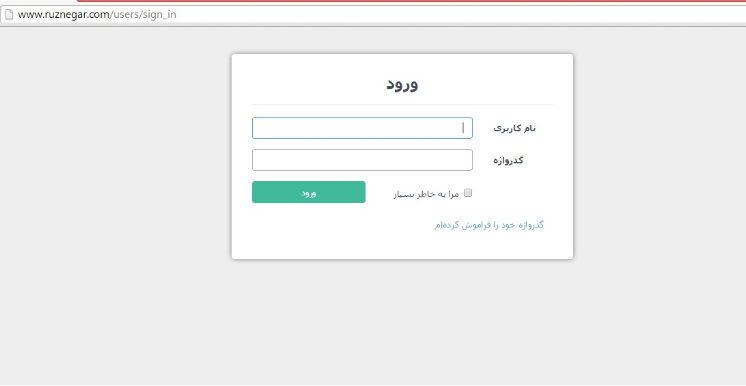
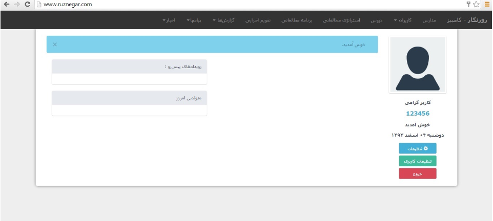
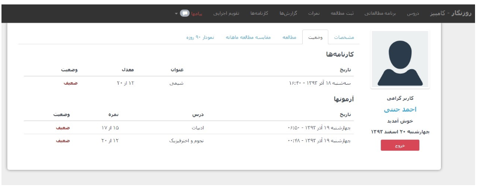
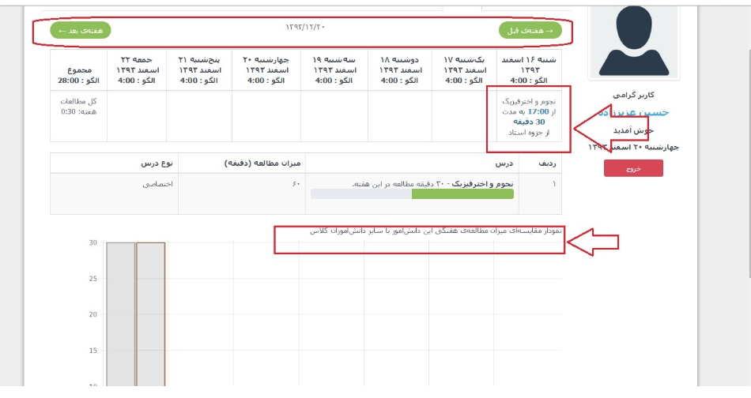
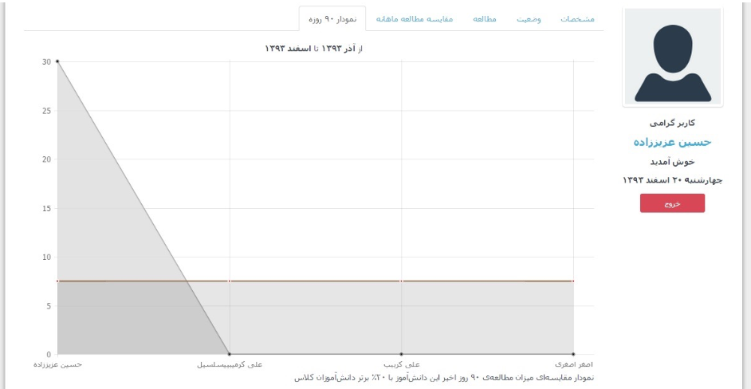
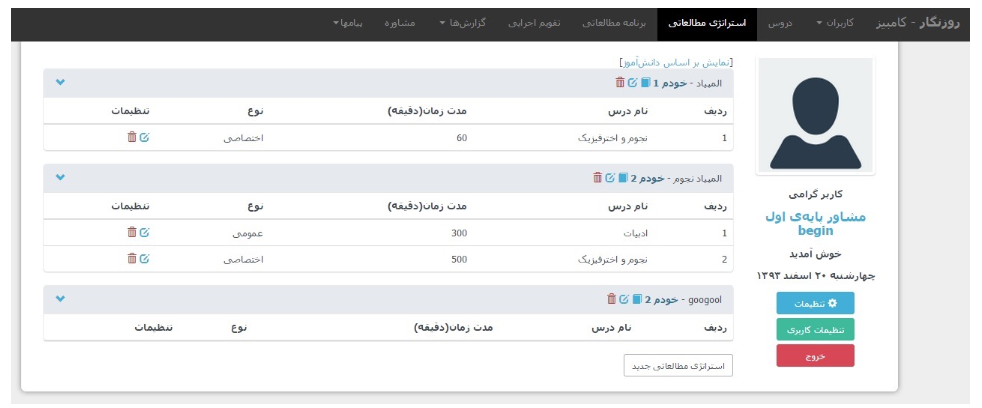
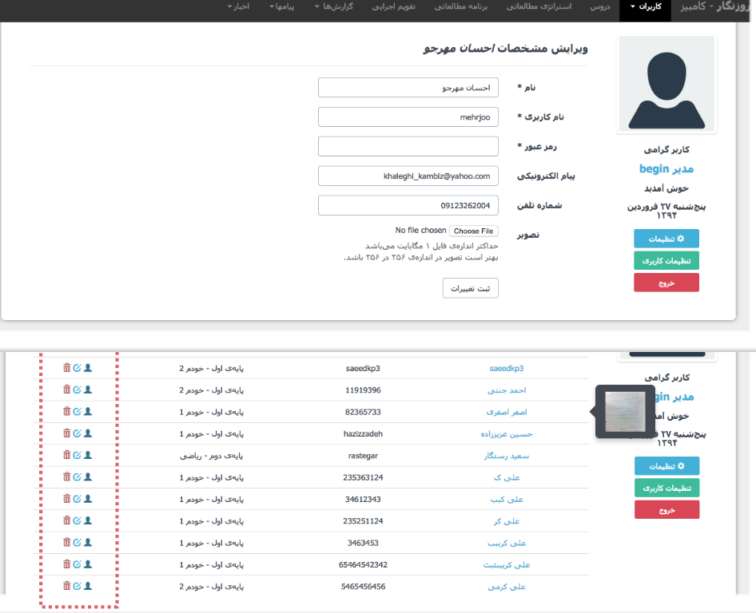

# Educational-portal
ruznegar is a fully fledged educational portal for high schooler that has been created at 2014, to read their grades and educational records and making cahrts  via reading csv files,  registering, authnetication via sms and email, dates, history fo record, having news blog for students, different roles for  adiminstartors, teachers, parents and student with different access, making  study schedule , capabilitse to edit, communicating with parents  by sending email and smsm through the portal and so forth

you can see  the mock up blew

